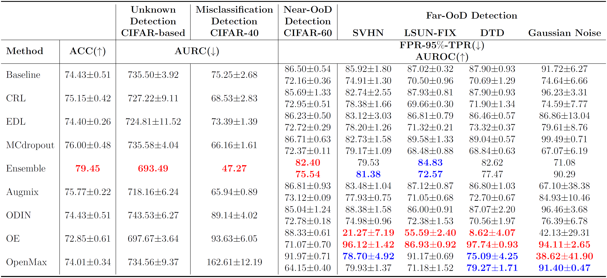

# unknown-detection-benchmarks

This repository contains the code for "A Unified Benchmark for Unknown Detection Capability of Deep Neural Networks.” A part of code for comparison methods has been based on the public code of each method such as [Correctness Ranking Loss](https://github.com/daintlab/confidence-aware-learning), [Evidential Deep Learning](https://github.com/dougbrion/pytorch-classification-uncertainty), [AugMix](https://github.com/google-research/augmix), [Outlier Exposure](https://github.com/hendrycks/outlier-exposure) and [OpenMax](https://github.com/abhijitbendale/OSDN).

## Overview

We argue that tasks including misclassification detection, open-set recognition and out-of-distribution detection, which are related to mitigate over-confident predictions should be treated as fundamentally an identical problem because an ideal model should possess detection capability for all those tasks. Therefore, we introduce the unknown detection task, an integration of previous individual tasks, for a rigorous examination of the detection capability of deep neural networks on a wide spectrum of unknown samples. To this end, unified benchmark datasets on different scales were constructed and the unknown detection capabilities of existing popular methods were subject to comparison.

### Requirements
```

* ubuntu 18.0.4, cuda >= 10.2
* python >= 3.6.8
* torch >= 1.2.0
* torchvision >= 0.4.0 

```

### Usage

* Train a classifier with the unknown detection benchmark
```
CUDA_VISIBLE_DEVICES=gpu-id python3 train.py --method baseline --benchmark cifar --data-dir ./data-dir/ --save-dir ./save-dir/ --trial 01
```

* Test the trained classifier with the unknown detection benchmark
```
CUDA_VISIBLE_DEVICES=gpu-id python3 test.py --method crl --benchmark imagenet --data-dir ./data-dir/ --save-dir ./save-dir/ --trial 01
```

The model should be stored under following directory structures for Deep Ensemble of models.
```

directory
  ├── /...-01/
  │     └──model_200.pth
  ├── /...-02/
  │     └──model_200.pth
  ├── /...-03/
  │     └──model_200.pth
  ├── /...-04/
  │     └──model_200.pth
  └── /...-05/
        └──model_200.pth
        
```


### Arguments

  |       name       |type |   available values   |                               help                             |
  |:----------------:|:---:|:--------------------:|:---------------------------------------------------------------|
  |    batch-size    | int |          int         |                             batch size                         |
  |     dropout      | str |         float        |                    architecture for training                   |
  |    benchmark     | str |    cifar, imagenet   |                    the name of behchmark data                  |
  |     data-dir     | str |    data directory    |             directory where the all data is located            |
  |     model-dir    | str |    model directory   |   directory where the save model is located (only for test)    |
  |     save-dir     | str |    save directory    |            directory where the results will be saved           |
  |    print-freq    | int |         int          |                         print frequency                        |
  |      trial       | str |         str          |                 the number of trial experiments                |


## The Unified Benchmarks Datasets
We briefly explain our unified benchmark datasets with download links. The benchmark datasets were constructed considering data scales. For the purpose of the unknown detection, each benchmark dataset includes near- and far-OoD according to semantic distance from in-distribution. Plus, there is the external dataset for hyperparameter tuning or for the training of certain methods if they require an auxiliary dataset.

The unified benchmark are constructed with following directory structures.
```
# CIFAR-benchmark for example

cifar-bench
    ├── /train/
    │     ├──cifar40
    │     └──new-tinyimagenet158
    ├── /valid/
    │     ├──cifar40
    │     └──new-tinyimagenet158
    └── /test/
          ├──cifar40
          ├──cifar60
          ├──describable-textures
          ├──lsun-fix
          ├──new-tinyimagenet158
          └──svhn
        
```


### CIFAR-based Benchmark
CIFAR-based benchmark is based on CIFAR-100, a relatively small-scale dataset with low resolution images. CIFAR-100 was divided into two parts to form in-distribution and near-OoD dataset. Datasets with similar scales to CIFAR-100 such as SVHN, LSUN-FIX and Describable Texture Dataset compose Far-OoD datasets after certain filtering process. Tiny ImageNet158-New is the external dataset in CIFAR-based benchmark.

[download CIFAR benchmark](https://docs.google.com/uc?export=download&id=1AJZEYGrvqNKKDeLMKEqgWMzuvjMJmEHb)

|            Dataset          |   Train   | Validation |    Test     |
|:---------------------------:|:---------:|:----------:|:-----------:|
|           CIFAR-40          |  18,000   |   2,000    |    4,000    |
|    Tiny ImageNet158-New     |  79,000   |   2,000    |       -     |
|           CIFAR-60          |     -     |     -      |    4,000    |
|             SVHN            |     -     |     -      |    4,000    |
|           LSUN-FIX          |     -     |     -      |    4,000    |
| Describable Texture Dataset |     -     |     -      |    5,640    |
|        Gaussian Noise       |     -     |     -      |   10,000    |


### ImageNet-based Benchmark
ImageNet-based benchmark is based on ImageNet dataset, the popular large-scale dataset with high resolution images. ImageNet dataset was divided into three parts to form in-distribution, near-OoD dataset and the external dataset. Datasets with similar scales to ImageNet such as Food-101, Caltech-256 and Places-365 compose Far-OoD datasets after certain filtering process.

[download ImageNet benchmark](https://docs.google.com/uc?export=download&id=1gapHov_B-DZ9bKOffg2DFx7lLPOe1T7l)

|         Dataset       |  Train  | Validation |    Test   |
|:---------------------:|:-------:|:----------:|:---------:|
|      ImageNet-200     | 250,000 |  100,000   |  10,000   |
| External ImageNet-394 | 485,700 |  197,000   |     -     |
|   Near ImageNet-200   |    -    |     -      |  10,000   |
|        Food-32        |    -    |     -      |  10,000   |
|      Caltech-45       |    -    |     -      |   4,792   |
|       Places-82       |    -    |     -      |  10,000   |


## Results
The results are extracted from our paper "A Unified Benchmark for Unknown Detection Capability of Deep Neural Networks.”

### CIFAR-based Benchmark



### ImageNet-based Benchmark


